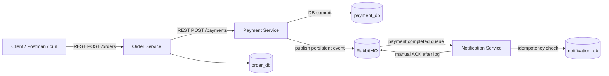

# AP2 Assignment 3 — Event-Driven Architecture with Message Queues

This project extends the previous Order + Payment microservice system with a new asynchronous Notification Service.

## Architecture



## Event flow

1. Client creates an order through `POST /orders`.
2. Order Service saves the order as `Pending`.
3. Order Service calls Payment Service.
4. Payment Service saves the payment result in `payment_db`.
5. If the payment is `Authorized`, Payment Service publishes `PaymentCompletedEvent` to RabbitMQ.
6. Notification Service consumes the event from the durable `payment.completed` queue.
7. Notification Service checks `processed_events` to avoid duplicate processing.
8. The notification is simulated by console log.
9. The message is ACKed only after successful processing.

## Reliability decisions

### Manual ACK

The consumer uses `autoAck = false`. It calls `Ack(false)` only after the notification log is printed successfully.

### Durable queue and persistent messages

RabbitMQ exchange and queue are declared as durable. The producer publishes messages with `DeliveryMode = amqp.Persistent`.

### Producer confirmation

Payment Service enables RabbitMQ publisher confirms. It waits for broker confirmation before treating the publish operation as successful.

### Idempotent consumer

Notification Service stores every processed `event_id` in `notification_db.processed_events`. If RabbitMQ redelivers the same event, the service ACKs it but does not print the notification again.

### DLQ bonus

The project includes a Dead Letter Queue:

- main queue: `payment.completed`
- DLX: `payment.dlx`
- DLQ: `payment.completed.dlq`

For demo, use `customer_email = "fail@example.com"`. Notification Service makes 3 processing attempts and then moves the message to the DLQ.

## Run

```bash
docker compose up --build
```

RabbitMQ Management UI:

```text
http://localhost:15672
username: guest
password: guest
```

## Test successful notification

```bash
curl -X POST http://localhost:8080/orders   -H "Content-Type: application/json"   -H "Idempotency-Key: order-001"   -d '{
    "customer_id": "123",
    "customer_email": "user@example.com",
    "item_name": "Coffee",
    "amount": 9999
  }'
```

Check logs:

```bash
docker logs ap2_notification_service
```

Expected log:

```text
[Notification] Sent email to user@example.com for Order #<order_id>. Amount: $99.99
```

## Test idempotency

Run the same curl command again with the same `Idempotency-Key`. Order Service returns the same order and Payment Service is not called again.

To demonstrate consumer idempotency directly, re-publish the same event with the same `event_id`; Notification Service will skip the duplicate because it already exists in `processed_events`.

## Test DLQ

```bash
curl -X POST http://localhost:8080/orders   -H "Content-Type: application/json"   -H "Idempotency-Key: order-dlq-001"   -d '{
    "customer_id": "123",
    "customer_email": "fail@example.com",
    "item_name": "Coffee",
    "amount": 9999
  }'
```

Then open RabbitMQ UI and check the queue `payment.completed.dlq`.

## Useful commands for defense

```bash
docker compose ps
docker logs ap2_order_service
docker logs ap2_payment_service
docker logs ap2_notification_service
```

```bash
curl http://localhost:8080/orders?min_amount=1\&max_amount=100000
```
